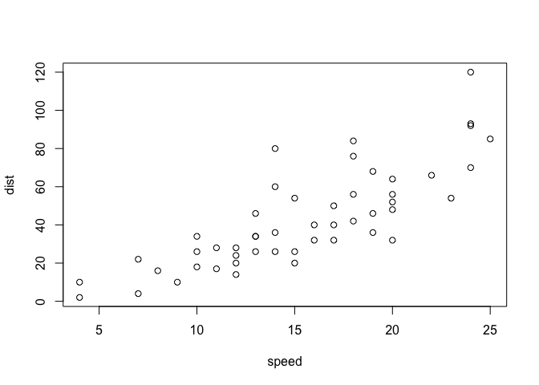

R Tidy
================

------------------------------------------------------------------------

First
-----

``` r
df = data.frame(Subject=rep(c("S1","S2","S3"), each=4),
                Visit=rep(c("V1","V2","V3","V4"), 3),
                Var1=rnorm(12), Var2=rnorm(12), Var3=rnorm(12))
df
```

    ##    Subject Visit        Var1         Var2        Var3
    ## 1       S1    V1 -0.94631528  0.485148510 -0.59568063
    ## 2       S1    V2 -0.36719384  1.781613718 -0.13691851
    ## 3       S1    V3 -0.49800078 -1.395590172 -0.76680896
    ## 4       S1    V4 -0.68343697 -0.070487823 -0.49168899
    ## 5       S2    V1  2.55866778  0.944759914  0.06569661
    ## 6       S2    V2 -0.36354022 -1.772992957 -0.21976442
    ## 7       S2    V3  1.44153472 -0.603469808  0.14730493
    ## 8       S2    V4  0.08921438 -1.868308660 -0.44634538
    ## 9       S3    V1 -1.20312104 -1.061268706 -0.03125530
    ## 10      S3    V2 -1.34694219  1.637016313 -0.84351738
    ## 11      S3    V3  0.05571668 -0.006410815 -1.56332110
    ## 12      S3    V4  0.01787364  0.341172880  1.82761222

This is an [R Markdown](http://rmarkdown.rstudio.com) Notebook. When you execute code within the notebook, the results appear beneath the code.

Try executing this chunk by clicking the *Run* button within the chunk or by placing your cursor inside it and pressing *Cmd+Shift+Enter*.

``` r
plot(cars)
```



Add a new chunk by clicking the *Insert Chunk* button on the toolbar or by pressing *Cmd+Option+I*.

When you save the notebook, an HTML file containing the code and output will be saved alongside it (click the *Preview* button or press *Cmd+Shift+K* to preview the HTML file).
